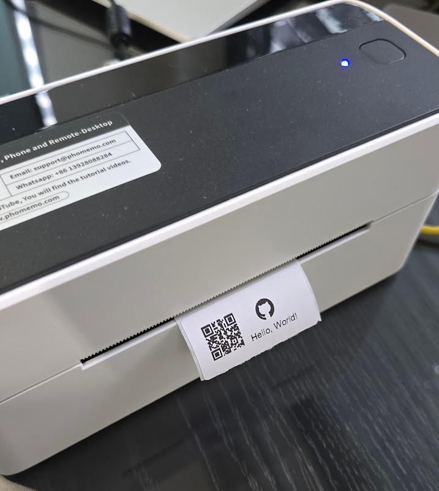

# Printing Labels with Python on macOS and Linux

This guide explains how to set up your environment and execute the provided Python script to print labels using the **PM-241-BT** printer on macOS and Linux. The script supports printing custom labels with QR codes, text, and optional images.

---

## Table of Contents
1. [Requirements](#requirements)
2. [Linux/MacOS Setup](#linux_macos-setup)
   - [Driver Installation](#driver-installation-1)
   - [Verifying Printer Availability](#verifying-printer-availability-1)
   - [Printing a Label](#printing-a-label-1)
3. [Python Script](#python-script)
   - [Script Details](#script-details)
   - [Running the Script](#running-the-script)
   - [Adding Images and QR Codes](#adding-images-and-qr-codes)
4. [Advanced Customizations](#advanced-customizations)
5. [Troubleshooting](#troubleshooting)

---

## Requirements
- **PM-241-BT printer** connected via USB.
- **Python 3** installed on your system.
- **Ubuntu** version used to test was `Ubuntu 22.04`.
- **MacOS** used to test was `Sonoma 14.5`.
- The following **Python** libraries:
  - `reportlab`
  - `qrcode`
  - `Pillow`

Install the required Python libraries with:
```bash
pip install reportlab qrcode pillow
```

---

## Linux/MacOS Setup

### Driver Installation
1. Download the respective OS driver for the PM-241-BT printer (PM-241-BT series Driver setup package (linux/mac)) from [Phomemo Drivers Website](https://eu.phomemo.com/pages/drivers).
2. Install the driver by running the downloaded package.
3. Connect the printer to your computer using USB.

### Verifying Printer Availability
1. Check the available printers using:
```bash
lpstat -p  
```
2. Look for a printer with a name like `_PM_241_BT` or `PM-241-BT`. Use this name in the Python script and commands.

### Printing a Label

The first step is to properly setup label size for a correct printing. To check the possibilities for this printer, please run following command replacing `<printer_name>` by the name of the printer in yor system (e.g. `_PM_241_BT` or `PM-241-BT`):
```bash
lpoptions -p <printer_name> -l
```
Among all the information given by the previous command, there is a list of possible `PageSize/Media Size` which can be used. The option used was the `Custom.WIDTHxWEIGHT` because it allows a customized label size. Regarding the orientation of the printing, it can also be configured in the command to execute. The next image was extracted from the [CUPS.org website](https://www.cups.org/doc/options.html).


To print a label with a `50mm x 25mm` size, a pdf file with the respective label content should be created. It is important to refer that the pdf should contain a file with same size as previously defined, in this case `50mm x 25mm`. To print a label, please run the following command replacing `<printer_name>` by the name of the printer in yor system (e.g. `_PM_241_BT` or `PM-241-BT`), changing the orientation value for the aimed configuration and updating the correct path for the pdf file to print:
```bash
   lp -d <printer_name> -o media=Custom.50x25mm -o orientation-requested=3 path/to/pdf/file.pdf
```

---

## Python Script

### Script Details
The Python script generates and prints labels using the `PM-241-BT` printer. The labels can include:
- **QR Codes**: Generated dynamically based on the input content.
- **Custom Text**: Position and font can be adjusted.
- **Optional Images**: Inserted alongside the QR code.

### Running the Script
Before going for the details regarding python script execution, it is important to refer that the label size used during this test was `50mm x 25mm`. If the planned label size has a different size, please update variables `label_width` and `label_height` at main python script file function accordingly. If these values are changed, the generated `label_with_qr.pdf` file may include some misaligned content and some ajustments may be required. Taking this information into consideration, please follow the next steps to proceed with the python script execution:

1. Clone this repository and navigate to the directory:
```bash
git clone https://github.com/PMCSilva/phomemo_PM-241-BT.git  
cd phomemo_PM-241-BT  
```
2. Update `linux_mac_print.py` main function variables `label_width`, `label_height` and `printer_name` (e.g. `_PM_241_BT` or `PM-241-BT`) if needed;
3. Run the script to generate and print a label:
```bash
python linux_mac_print.py  
```

4. The script generates a `label_with_qr.pdf` file and sends it to the printer. Verify that the label prints correctly.



### Adding Images and QR Codes
The script supports adding images and QR codes to the label. Customize the script with your own content:
- Replace the **label text** and **QR code content** in the `generate_label_pdf()` function.
- Add an image by specifying its path in the `image_path` parameter.

---

## Advanced Customizations

### Including an Image in Black-and-White
To include an image in the label, ensuring it appears in black and white, the script can be modified to process the image:
- Convert the image to black-and-white using the `Pillow` library.
- Add the processed image to the label at the desired position.

This convertion is done at `convert_image_to_bw()` function.

---

## Troubleshooting

### Common Issues
1. **Printer Not Found**:  
   - Ensure the printer is connected and listed using `lpstat -p`.  
   - On Linux/MacOS, verify the CUPS service is running.

2. **Paper Size Errors**:  
   - Ensure the correct paper size is specified (e.g `Custom.50x25mm`).  
   - Verify the printer supports the defined label size.

3. **Permission Errors**:  
   - Run commands with sudo if permissions are denied.  
   - Ensure the printer is added as a trusted device in your system.


By following this guide, you should be able to generate and print custom labels with QR codes and images on **Linux/MacOS** using the `PM-241-BT` printer.