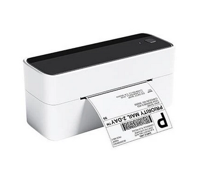

# Phomemo label printer project

A Python-based script for printing labels with QR codes and images on three major operating systems: **Linux**, **macOS**, and **Windows**. This tool allows users to specify custom label sizes, generate QR codes, include images, and print directly to a label printer. In this particular project, the used label printer was a PM-241-BT from [Phomemo](https://phomemo.com) like following image shows. This printer was purchused at [amazon](https://www.amazon.es/dp/B0BSBTWQ17/ref=sr_1_1_sspa?crid=16WX4MIKH32L3&dib=eyJ2IjoiMSJ9.M09FS4lmpkLF2MN9NbHTgkgqQoCzPodHLyieukvrzHcR-ybIID_CjKIP8OGh5nyF7n1dvflcRViH7w0famM_w-eefLjYxCHDEZcYvkmSqDsgzswr2Ny5Y4HP0RkyBHo_1soLQdr4DWgSsWNSynBB6A._9Rxx4f8yPZiau79RMGMFmzYN9PCwMMkP1ATTlkFMVU&dib_tag=se&keywords=pm-241-bt&nsdOptOutParam=true&qid=1732195655&sprefix=pm-241-bt%2Caps%2C123&sr=8-1-spons&sp_csd=d2lkZ2V0TmFtZT1zcF9hdGY&th=1).

---

## Features

- **Cross-Platform Compatibility**: Works on `Linux`, `MacOS`, and `Windows`.
- **Customizable Labels**: Specify label dimensions (e.g., 50mm x 25mm).
- **QR Code Generation**: Dynamically generate and embed QR codes in labels.
- **Images printing**: Convert images to black & white format and add them to labels.
- **Customizable printing script**: Easy to customize python script to easily fit user needs.

---

## Requirements

### General
- Python 3.7 or later.
- `PM-241-BT` printer from [Phomemo](https://phomemo.com) or similar.
- A working printer series driver setup installed for the respective operating system. Please check Phomemo's driver [download](https://eu.phomemo.com/pages/drivers) page.

---

# Environment Setup

- To check for the `Linux/MacOS` setup preparation, please take a closer look on the following [README](.doc/readmes/README_LINUX_MAC.md) file included in this repository.
- To check for the `Windows` setup preparation, please take a closer look on the following [README](.doc/readmes/README_WINDOWS.md) file included in this repository.

These setup guides cover driver installation, printer configuration, label size customization, and Python script execution to print your labels successfully.

---

## Contribution and Support

Feel free to contribute to this project by submitting issues or pull requests.
