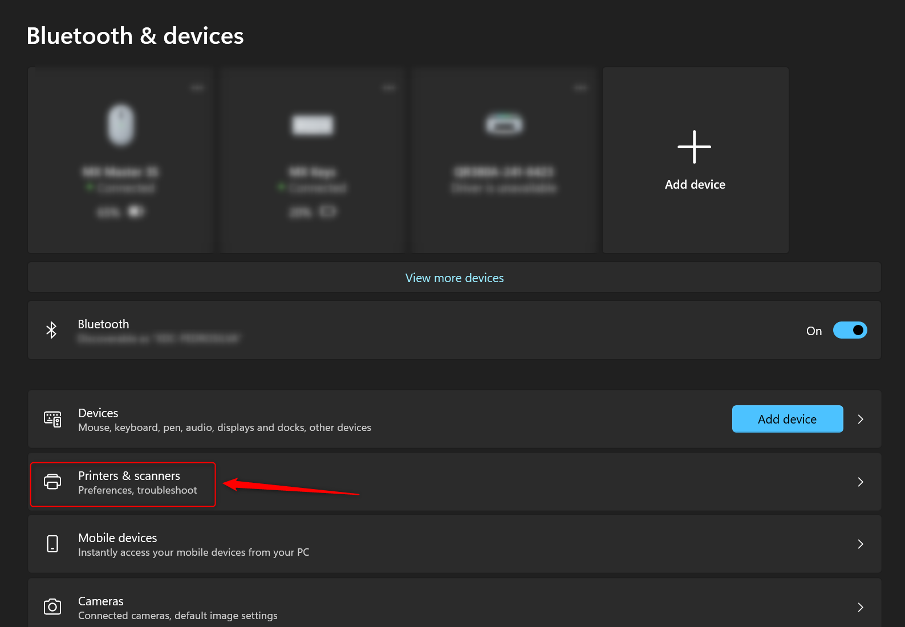
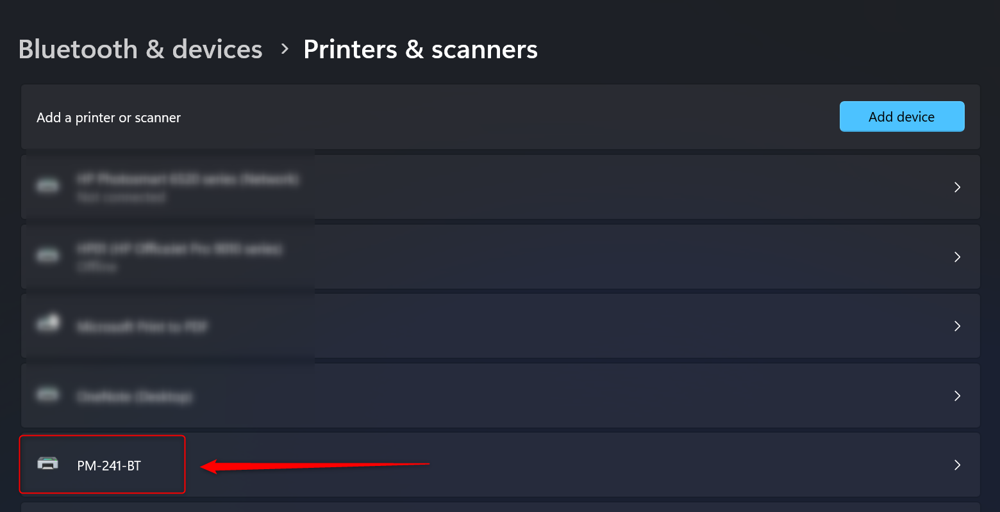
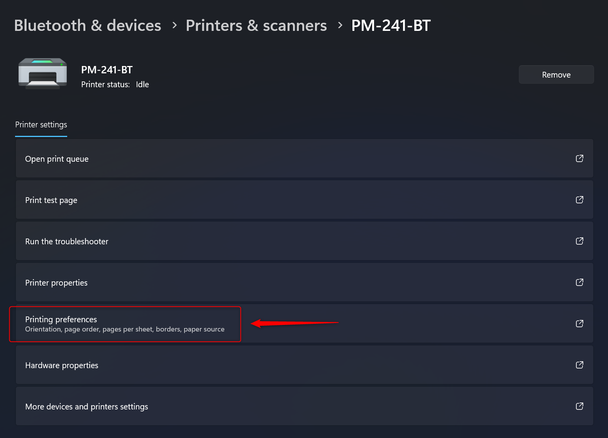
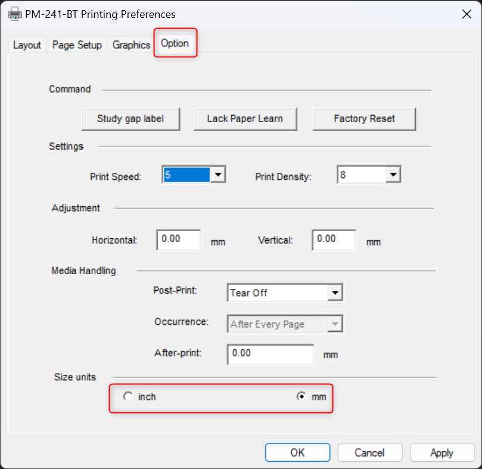
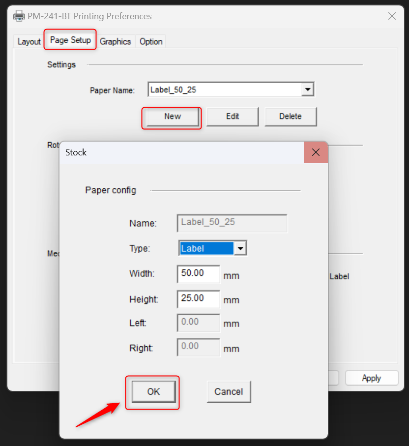
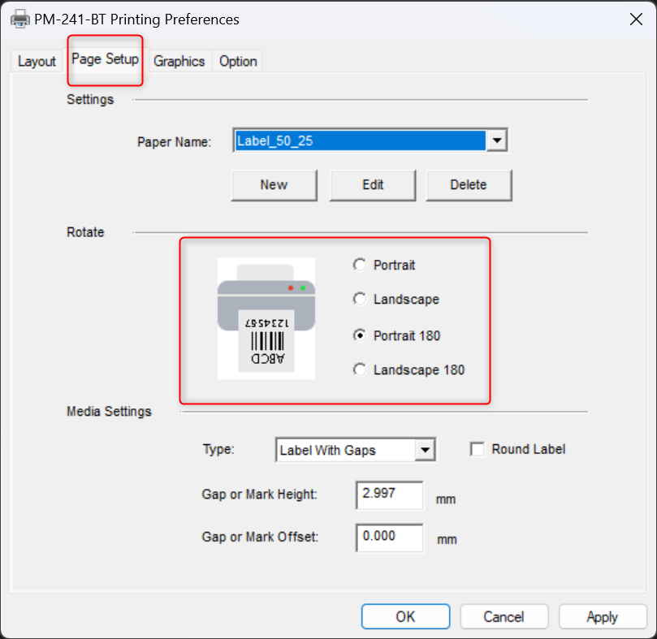
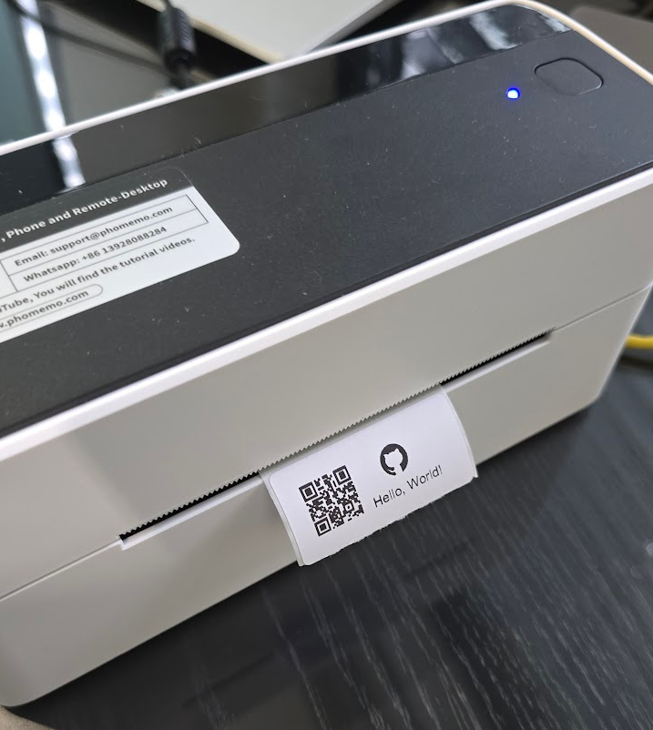

# Printing Labels with Python on Windows

This guide explains how to set up your environment and execute the provided Python script to print labels using the **PM-241-BT** printer on Windows. The script supports printing custom labels with QR codes, text, and optional images.

---

## Table of Contents
1. [Requirements](#requirements)
2. [Windows Setup](#windows-setup)
   - [Driver Installation](#driver-installation)
   - [Verifying Printer Availability](#verifying-printer-availability)
   - [Printing a Label](#printing-a-label)
3. [Python Script](#python-script)
   - [Script Details](#script-details)
   - [Running the Script](#running-the-script)
   - [Adding Images and QR Codes](#adding-images-and-qr-codes)
4. [Advanced Customizations](#advanced-customizations)
5. [Troubleshooting](#troubleshooting)

---

## Requirements
- **PM-241-BT printer** connected via USB.
- **Python 3** installed on your system.
- **Windows 11** operating system.
- The following **Python** libraries:
  - `reportlab`
  - `qrcode`
  - `Pillow`

Install the required Python libraries with the command:
```bash
pip install reportlab qrcode pillow
```

---

## Windows Setup

### Driver Installation
1. Download the `PM-241-BT` driver for Windows (PM-241-BT series Driver setup package (windows)) from [Phomemo Drivers Website](https://eu.phomemo.com/pages/drivers).
2. Install the driver by running the downloaded package.
3. Connect the printer to your computer using USB.

### Verifying Printer Availability
1. Open PowerShell or Command Prompt.
2. Run the following command to list available printers:
```bash
Get-Printer | Format-Table Name, PrinterStatus
```
3. Look for a printer with a name like `PM-241-BT`. Use this name in the Python script and commands.

### Printing a Label

The label size needs to be set properly before printing. To check the available paper sizes for the printer, do the following:

1. Open the printer’s properties:
   - Go to **Control Panel > Devices and Printers**.
   - Click at **Printers & Scanners** like next image shows.
   
   - Chose **PM-241-BT** printer.
   
   - Open printing preferences.
   

2. Check which units you want to use going to **Option** tab. In this example the unit is `mm`:


3. Check for available label sizes:
   - Go to **Page Setup** tab.
   - Click **New**, specify the desired dimensions (e.g., `50mm x 25mm`), and save it with a name of your choice.
   
   - Ensure the custom size appears in the printer preferences.

4. In **Page Setup** tab is also possible to selected the desired label rotation:


5. Once all the configuration is performed, please click **Apply** and **OK**.

3. To print the label, use the following PowerShell command:
```bash
Start-Process -FilePath "path\to\label.pdf" -Verb PrintTo -ArgumentList "PM-241-BT"
```

Replace `path\to\label.pdf` with the path to the PDF file and `PM-241-BT` with your printer's name.

---

## Python Script

### Script Details
The Python script generates and prints labels using the `PM-241-BT` printer. The labels can include:
- **QR Codes**: Generated dynamically based on the input content.
- **Custom Text**: Position and font can be adjusted.
- **Optional Images**: Inserted alongside the QR code.

### Running the Script
Before running the script, ensure the following:
1. The label size in the script matches your printer settings. Update `label_width` and `label_height` variables in the script.
2. Verify that the `printer_name` variable matches your printer name (e.g., `PM-241-BT`).

Steps to run the script:
1. Clone this repository and navigate to the directory.
2. Update the `label_width`, `label_height`, and `printer_name` variables in the `windows_print.py` main function if needed.
3. Execute the script to generate and print a label:
```bash
python windows_print.py  
```
4. The script generates a `label_with_qr.pdf` file and sends it to the printer. Verify that the label prints correctly.


---

### Adding Images and QR Codes
The script supports adding images and QR codes to the label. Customize the script with your own content:
- Replace the **label text** and **QR code content** in the `generate_label_pdf()` function.
- Add an image by specifying its path in the `image_path` parameter.

---

## Advanced Customizations

### Including an Image in Black-and-White
To include an image in the label, ensuring it appears in black and white, the script can be modified to process the image:
- Convert the image to black-and-white using the `Pillow` library.
- Add the processed image to the label at the desired position.

This conversion is handled in the `convert_image_to_bw()` function.

---

## Troubleshooting

### Common Issues
1. **Printer Not Found**:
   - Ensure the printer is connected and visible in **Devices and Printers**.
   - Run `Get-Printer | Format-Table Name, PrinterStatus` in PowerShell to verify its availability.

2. **Paper Size Errors**:
   - Verify that the printer driver includes the custom label size.
   - Recreate the custom size in **Print Server Properties** if needed.

3. **Printing Errors**:
   - Ensure the correct label size is set in the printer preferences and matches the size defined in the script.

4. **Permission Errors**:
   - Run PowerShell as an administrator if permissions are denied.

---

By following this guide, you should be able to generate and print custom labels with QR codes and images on **Windows** using the `PM-241-BT` printer.
